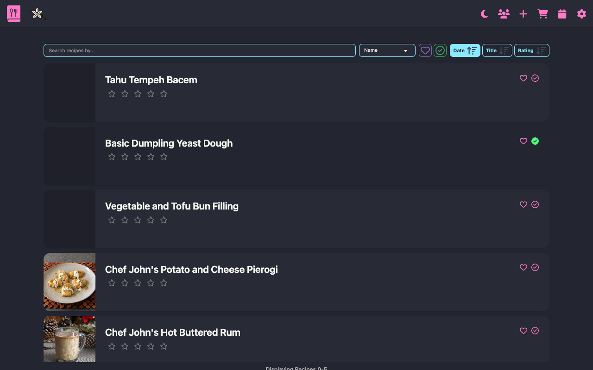

# Vanilla Cookbook

For a full getting started guide, [read the docs](https://vanilla-cookbook.readthedocs.io/en/latest/).




## Overview

Vanilla Cookbook is a self hosted recipe manager built with Svelte(kit). It is designed with complexity under the hood, keeping the user experience as uncluttered, simply vanilla as possible.

Most of the web's recipes are stored as text, without much thought to a consistent language or structure. Many self-hosted apps go down the structuring route, automating, or asking the user to organise their data. This can lead to cluttered and complex interfaces, limiting user experiences to those technically minded. The philosophy behind Vanilla was to do as much as I could with that text as it was, limiting the work the user has to do to a minimum. You should be able to get cooking with a few clicks.

## Features

### Unit Conversion

Smart conversion from US Volumetric to imperial and metric weight. Thousands of ingredients supported in this conversion. Inline temperature conversion, fractions and ranges are also supported. [Docs](https://vanilla-cookbook.readthedocs.io/en/latest/manual/ingredients/#conversion)

### Recipe Scaling

Scale your recipe ingredients. No complicated data entry, it's all done under the hood.

### Control Your Data

Multiple import formats supported, exports supported. [Docs](https://vanilla-cookbook.readthedocs.io/en/latest/manual/import/)

### Scraping Recipes

Scrape recipes using a browser bookmarklet or simply paste a URL in. Hundreds of sites supported. [Docs](https://vanilla-cookbook.readthedocs.io/en/latest/manual/usage/#recipe-add)

### AI Scrape Assist

Add an LLM API key to assist in:

- Parsing HTML on fail
- Parsing plain text paste
- Processing an image

[Docs](https://vanilla-cookbook.readthedocs.io/en/latest/manual/usage/#ai-assist)

### Progressive Web App

Install on your mobile from a browser. [Docs](https://vanilla-cookbook.readthedocs.io/en/latest/manual/installation/#mobile)

Share URL via browser to scrape a recipe, or select text and share to parse text.

### Shopping List

Simple shopping list section. Add ingredients from your recipe. Checked ingredients persist but hidden, show them to make your next shopping list. [Docs](https://vanilla-cookbook.readthedocs.io/en/latest/manual/apps/#shopping)

### Cooking Logs

Log when you've cooked a recipe. Calendar view, recipe view of logs. [Docs](https://vanilla-cookbook.readthedocs.io/en/latest/manual/apps/#calendar)

### User Management

User authentication is supported. You can add users, turn on/off registration. [Docs](https://vanilla-cookbook.readthedocs.io/en/latest/manual/usage/#privacy)

### Automated Database Backups

Docker installations include automatic backups to protect your recipe data:

- **Scheduled backups**: Weekly backups run every Sunday at 3am by default, keeping the 6 most recent backups (6 weeks of history). Configurable via `BACKUP_CRON_SCHEDULE` in `.env` (supports standard cron syntax for daily, monthly, or custom schedules).
- **Pre-migration backups**: Automatic backup created before any database schema migrations to ensure safe upgrades.
- **Retention management**: Configure how many scheduled backups to keep with `BACKUP_RETENTION_COUNT` in `.env` (default: 6).
- **Accessible backups**: All backups are stored in your mounted `./db` folder alongside your active database:
  - `scheduled-backup-YYYYMMDD-HHMMSS.sqlite` - Regular scheduled backups (auto-cleaned)
  - `auto-backup-YYYYMMDD-HHMMSS.sqlite` - Pre-migration backups (preserved)

After changing backup settings, restart the container: `docker-compose restart`

### Public Recipes

Recipes and your personal cookbook can be made public, so you can share them with friends and family.

### Easy Installation

Designed to be as easy and stress free to set up as possible. Docker or local node instance.

### Multiple Language Ingredient Parsing

Multiple languages supported for ingredient parsing. [Docs](https://vanilla-cookbook.readthedocs.io/en/latest/manual/ingredients/#languages)

Currently:

- English
- German
- Italian
- Spanish
- French
- Portuguese
- Indonesian
- Hindi
- Russian
- Arabic

## Installation

### Docker

1. In your project directory, create the _.env_ and _docker-compose.yml_ files using the respective _.template_ files in the repo root:

   ```bash
   curl -o .env https://raw.githubusercontent.com/jt196/vanilla-cookbook/main/.env.template
   curl -o docker-compose.yml https://raw.githubusercontent.com/jt196/vanilla-cookbook/main/docker-compose.yml.template
   ```

2. In the _.env_ file
   - Change the _ORIGIN_ to the URL it's going to be hosted on. If you get any login CORS messages, this not being set correctly will be the reason. The default `ORIGIN=http://localhost:3000` should work with the default _docker-compose.yml_ file unless you have anything else on that port.
3. Create _db_ and _uploads_ folders for persistence in your docker folder, make sure the share paths are correct in the docker-compose file: `mkdir -p ./db ./uploads`
4. Use `:latest` tags for bleedin' edge, `:stable` for stable release.
5. Run `docker-compose up -d`
6. On first run, you'll be prompted to enter Admin user details.

### Local Dev

**Prerequisites**: You'll need build tools installed for native module compilation (better-sqlite3):

- **macOS**: Xcode Command Line Tools (`xcode-select --install`)
- **Linux**: `build-essential` package (Ubuntu/Debian: `sudo apt-get install build-essential`)
- **Windows**: Visual Studio Build Tools or windows-build-tools npm package

**Setup**:

1. Clone the repo and the recipe-ingredient-parser submodule: `git clone --recursive https://github.com/jt196/vanilla-cookbook.git`
2. At the root of the project, create the .env file: `cp .env.template .env`
3. In the _.env_ file
   1. Set `ORIGIN` to `http://localhost:5173` (dev).
4. Run it
   - `pnpm dev:install` (node packages and prisma client install)
   - `pnpm dev`
5. You'll be prompted for admin user details on accessing root

## Upgrade

1. Grab the latest image: `docker pull jt196/vanilla-cookbook`
2. Check the _.env.template_ and _docker-compose.yml.template_ files haven't been modified. Add any additional fields. The _.env_ is the most likely to change.
3. From the project directory, run `docker-compose up -d` or `docker compose up -d` depending on how you have it installed on your system.
