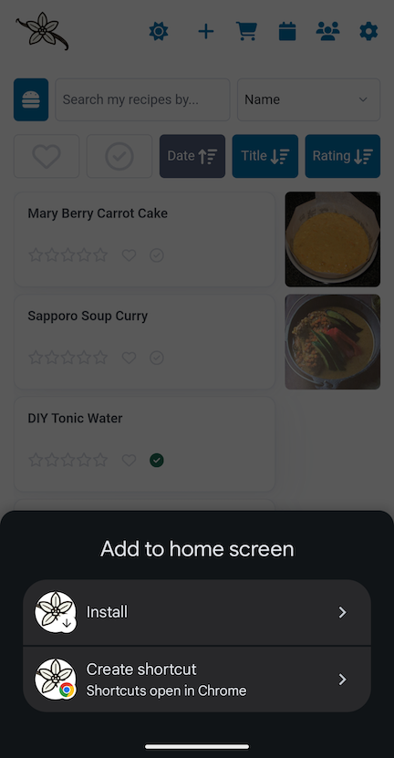
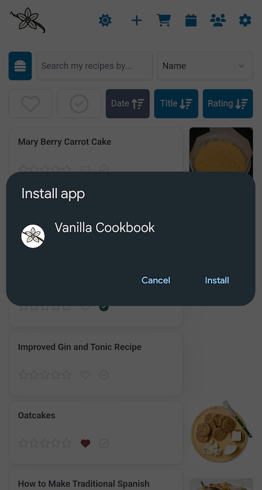
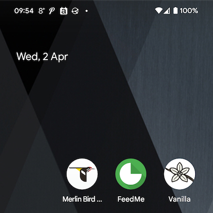

## Installation



---

## Upgrade



## Mobile

Most folks know how to do this but I'll chuck some instructions up anyway. It's pretty close to to an Android app experience. Install from Chrome (I've found Firefox doesn't offer the _install_ option) with > settings > add to home screen > install:

