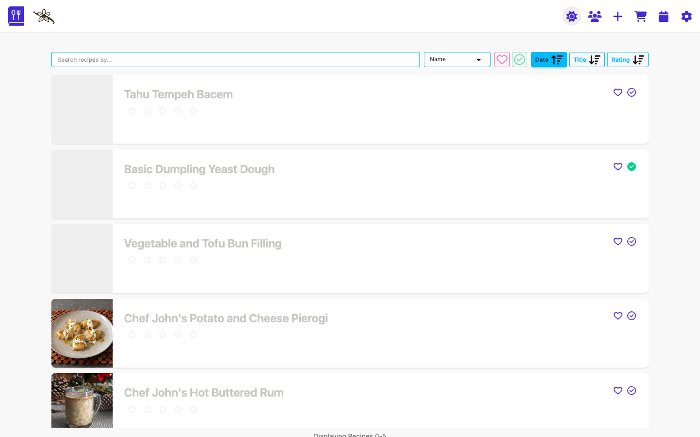
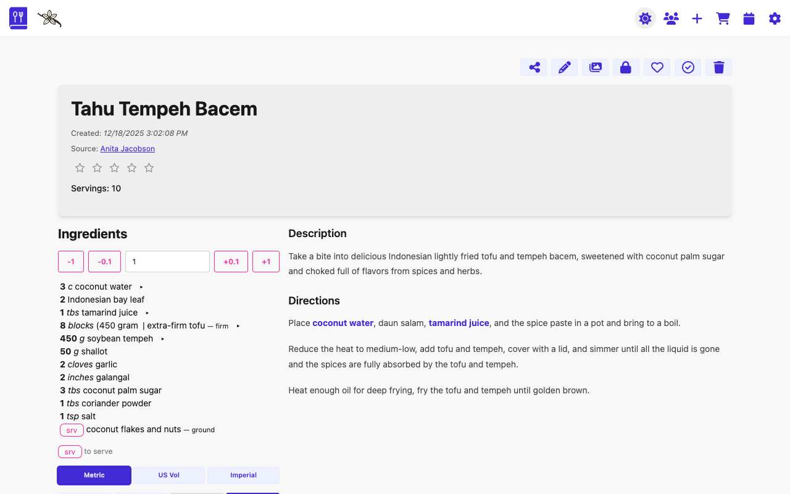
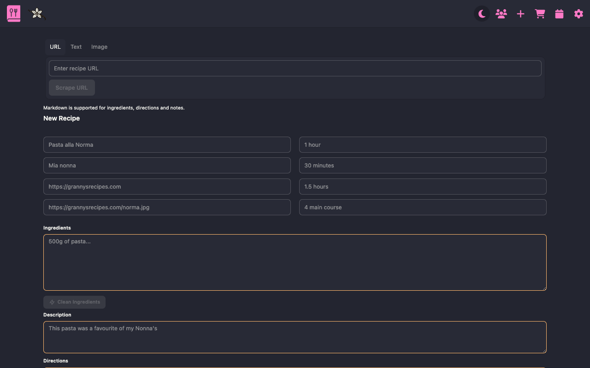
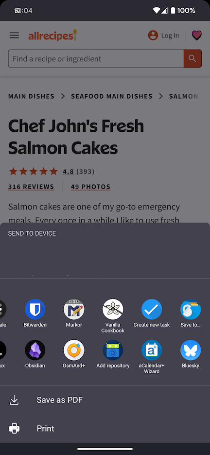
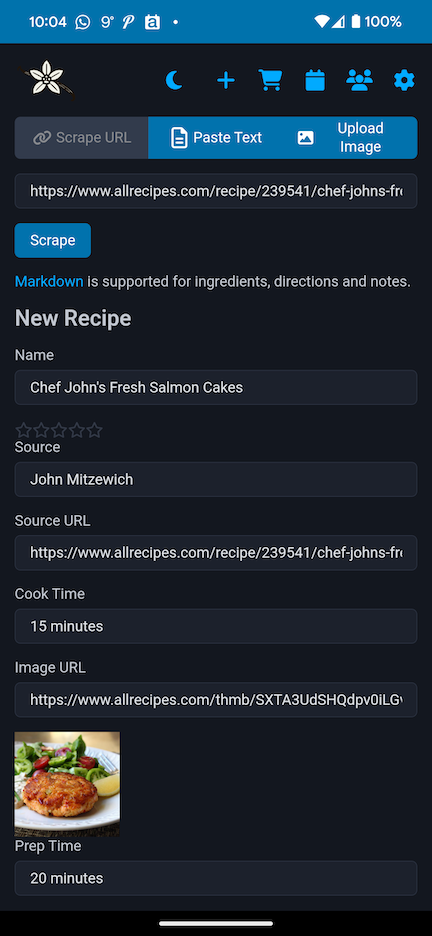
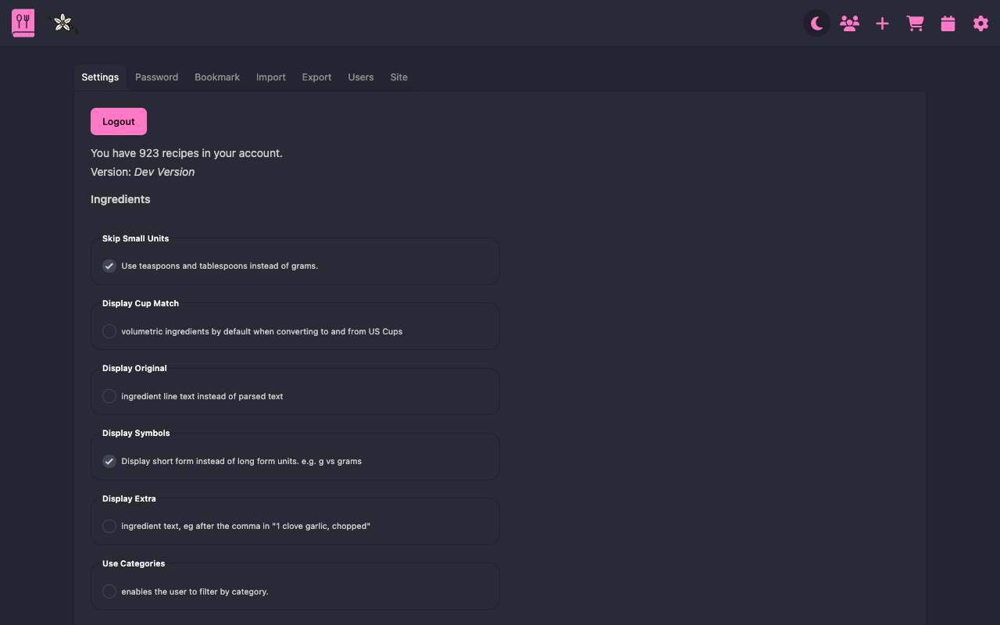
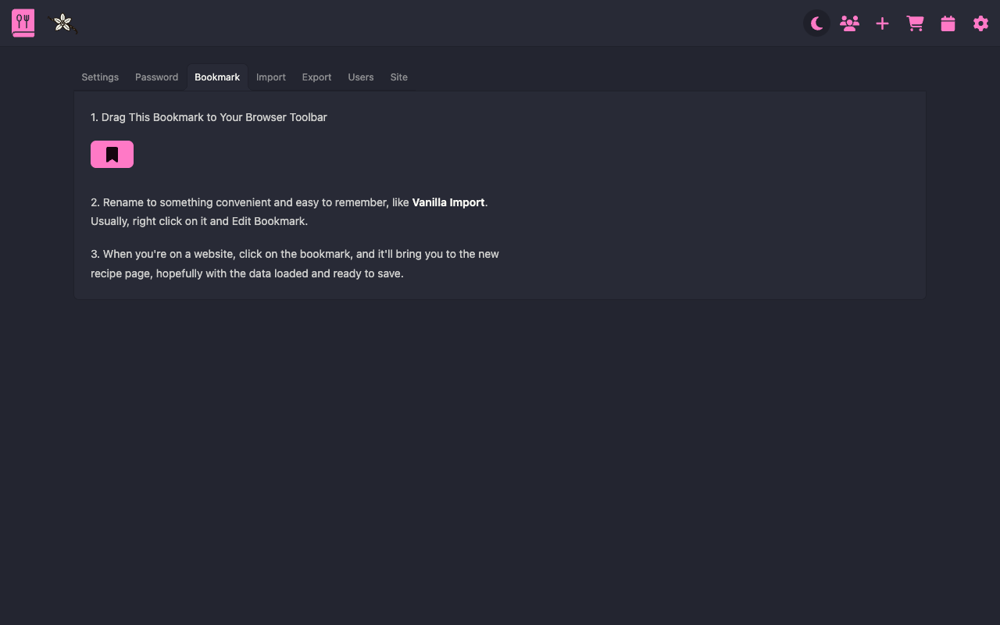
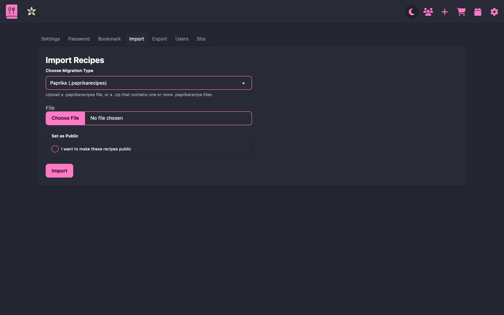
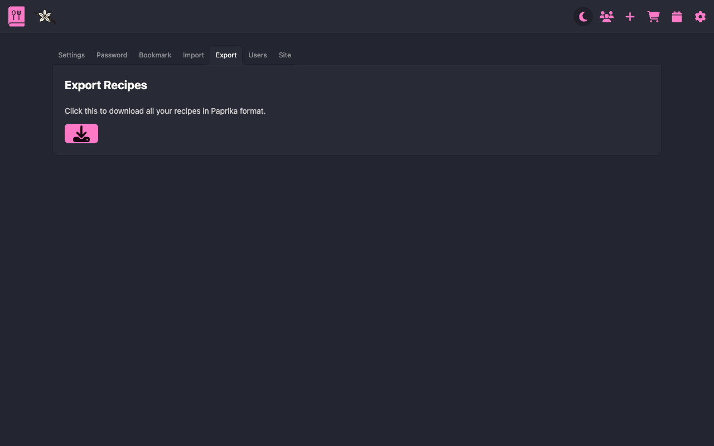
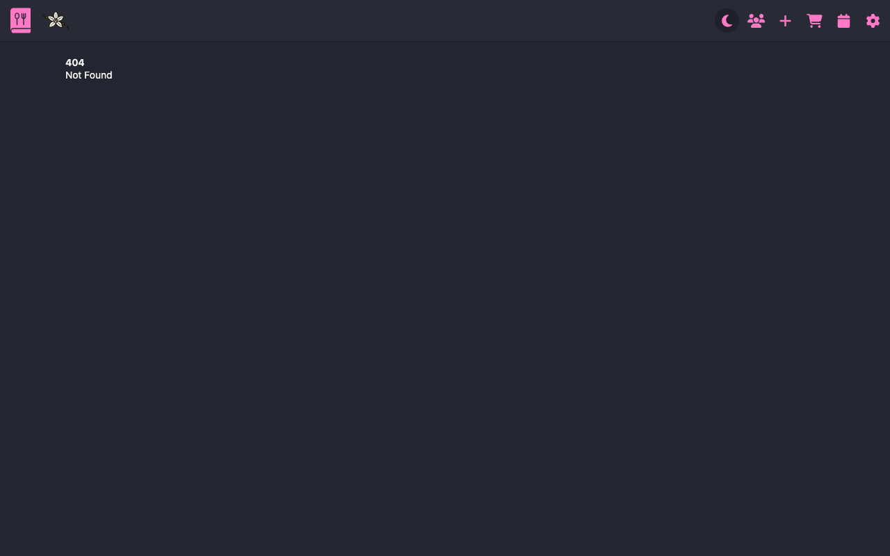

# Usage

## Recipe List View



### Buttons

From left to right:

- **Add Recipe**: Add new recipes manually or using the scraper
- **[Shopping List](apps.md#shopping)**: A simple list to help you with your weekly shop
- **[Calendar](apps.md#calendar)**: Visual record of your previous cooked recipes
- **Users**: List of the users on your instance
- **Settings**: Configuration section

### Filters

From left to right

- **Display Category Tree** - Imported Paprika categories will be displayed here
- **Filter with text string** - Search by multiple methods
- **Specify filter** - Name, Ingredient, Source, Notes
- **Filter favourites** - List all your favourite recipes
- **Filter cooked** - List all the cooked recipes
- **Sort by Date, Title or Rating** - Sort the recipes by various means

### Recipe Card

Displays info about your recipes.

## Recipe View



### Recipe Buttons

From left to right:

- **Back** to the recipe list
- **Edit Recipe**
- **Manage Images**
- **Favourite Recipe**
- **Mark Recipe as Cooked today**
- **Delete Recipe**

### Recipe About

All your recipe info is here. Ratings, source, creation date, servings.

### Recipe Instructions

Description, Instructions and Notes sections will appear here. Markdown is fully supported.

### Recipe Ingredients

Your list of ingredients and scaling appear here. Markdown is also fully supported. The ingredients are stored as plain text and parsed by the backend. This allows for conversion from US volumetric to weight conversion.

Please see the [ingredients docs](ingredients.md) for more details about how to correctly format your ingredients.

Click on the ingredient line to mark as "checked" for the duration of the recipe.

Hover over and click the shopping basket button to the left of the ingredient to add it to the shopping list.

You have three checkboxes here:

- **Display Cup Match** volumetric ingredients by default when converting to and from US Cups. This is a bit "fuzzy" and not always perfect, so sometimes useful to check what ingredient the system. If no ingredient has been found, you'll see a '\*' and a note that it has been matched to water.
- **Display Original** ingredient line text instead of parsed text. The parser will go through an ingredient line and attempt to separate quantity, unit, ingredient and any extra information. If this fails, you can simply use a fallback, but the scaling won't work.
- **Display Extra** ingredient text, eg after the comma in "1 clove garlic, chopped"

You can set your default options in the settings section.

## Recipe Add



Add your recipe here. Multiple sources accepted:

- Websites with Schema.org recipe schema (most of the web)
- Websites with no schema
- Pasted Text
- Images of recipes

**Android PWA sharing** a URL or text to the new page is supported.





### Websites

Either use the old skool bookmarklet (found in /user/options/bookmark), or paste the URL in the first box, then press scrape.

If the site has a well-formed Schema.org recipe object, you should get a returned, fully formed recipe quite quickly.

If the standard recipe scrape fails (criteria being: no name, no ingredients), it'll try with an OpenAI API key.

### AI Assist

#### Scrape Fallback

If the recipe parse fails, and you have the ai option enabled, plus key set in the variables, it'll submit the HTML of the recipe page for an AI to parse.

Add your LLM config to the `.env` file. Supported providers out of the box: OpenAI, Anthropic, Google (Gemini), Ollama (text only). Env shape:

```env
LLM_API_ENABLED=true
LLM_PROVIDER=openai           # default provider (openai|anthropic|gemini|ollama)
LLM_TEXT_MODEL=gpt-3.5-turbo  # text model
LLM_IMAGE_MODEL=gpt-4o        # image model (ignored for ollama)
# optional per-stream overrides
LLM_TEXT_PROVIDER=
LLM_IMAGE_PROVIDER=
# keys (generic or provider-specific)
LLM_API_KEY=
OPENAI_API_KEY=
ANTHROPIC_API_KEY=
GOOGLE_API_KEY=
OLLAMA_BASE_URL=http://localhost:11434
```

- Image parsing is disabled when using Ollama as the image provider (it does not support image prompts). The UI hides the image tab if the selected provider is Ollama.
- For exact model names, refer to each provider’s own documentation/console. LangChain docs show usage but not full model catalogs. Choose a text model for `LLM_TEXT_MODEL` and an image-capable model for `LLM_IMAGE_MODEL` (OpenAI/Google support images; Anthropic/Ollama are text-only in this flow).

Set `LLM_API_ENABLED=true`. The default model should work.

Test the demo on [this URL](https://pastebin.com/raw/zwgsuVKd) to check it works.

Here's a demo of it working:

<video width="640" height="360" controls>
  <source src="../../videos/scrape_and_parse_demo.mp4" type="video/mp4">
  Your browser does not support the video tag.
</video>

#### Text Parsing

Click on the Parse button at the top of the + new page (hidden if you don't have API key or AI enabled in the `.env` file) and you'll be presented with a large input box. Paste your recipe in there and see whether an LLM can make something of the data! It works pretty well in the demo above.

#### Image Recognition

Beta-ish, but working on my test computer. Upload up to 3 images; the app will resize and stitch them together for better multi-page parsing, then send to the configured image-capable LLM. It may take a bit longer than text parsing, but not too long. Pukka!

Here's a demo, feel free to fast forward the middle bit where it's waiting for the response... Unless 20 seconds of me wiggling my mouse around sounds attractive.

<video width="640" height="360" controls>
  <source src="../../videos/image_parsing.mp4" type="video/mp4">
  Your browser does not support the video tag.
</video>

#### Clean Ingredients

When adding or editing a recipe, you'll find a "Clean Ingredients" button below the ingredients field (available when AI is enabled). This feature uses AI to tidy up your ingredient list according to these rules:

1. **Remove dual units** - If ingredients have both metric and imperial measurements (e.g., "28g (1oz) flour"), it keeps only your preferred unit system
2. **Standardize alternatives** - Moves alternative ingredients after a comma with "or" (e.g., "1 tomato or 0.5 tin tomatoes" → "1 tomato, or 0.5 tin tomatoes")
3. **Remove brackets** - Removes parentheses while keeping important info after a comma
4. **Move preparation instructions** - Places prep details after a comma (e.g., "1 onion (chopped)" → "1 onion, chopped")
5. **Remove conversational text** - Strips out non-essential text while keeping ingredient data
6. **Use decimal numbers** - Converts fractions to decimals (e.g., "1 1/2 kg" → "1.5 kg")
7. **Remove prepositions** - Eliminates words like "of" (e.g., "1.5 kg of flour" → "1.5 kg flour")

This feature respects your language settings and preferred unit system (metric/US/imperial).

<video width="640" height="360" controls>
  <source src="../../videos/ingredients_tidy_demo.mp4" type="video/mp4">
  Your browser does not support the video tag.
</video>

#### Summarize Directions

Similar to the ingredient cleanup, the "Summarize Directions" button appears below the directions field. This feature condenses verbose recipe instructions to their essential steps, removing:

- Conversational tone and extra explanations
- Unnecessary tips and commentary
- Redundant information

The AI assumes an intermediate level of culinary experience, keeping all necessary steps but making each one more concise. This is particularly useful for recipes scraped from blogs that include lengthy personal anecdotes or overly detailed explanations.

<video width="640" height="360" controls>
  <source src="../../videos/directions_summarize_demo.mp4" type="video/mp4">
  Your browser does not support the video tag.
</video>

### Add it

Complete the recipe form, then click the **Add Recipe** button at the bottom. The Edit page is basically the same as this. If the images are successfully saved, they'll be in the _uploads/images_ folder. Image URLs should grab the image and save it there.

## OAuth

Two providers are available, GitHub and Google. You'll need to set the relevant _.env_ variables in the file:

```shell
GOOGLE_CLIENT_ID=
GOOGLE_CLIENT_SECRET=
GITHUB_CLIENT_ID=
GITHUB_CLIENT_SECRET=
```

### GitHub

- GitHub instructions are [here](https://docs.github.com/en/apps/oauth-apps/building-oauth-apps/creating-an-oauth-app)
- Basically go to your [Developer Settings](https://github.com/settings/developers) > OAuth Apps > New OAuth App
- Essential fields:
  - **Homepage URL**: <https://my-vanilla-site.com>
  - **Authorisation Callback URL**: <https://my-vanilla-site.com/api/oauth/callback>

### Google

- As usual, anything Google console related is somewhat more difficult than it has to be.
- Get your project set up in the [Cloud Console](https://console.cloud.google.com).
- Go to APIs and Services > Credentials > Create Credentials > OAuth Client ID
- Essential Fields (you can have multiple URIs):
  - **Authorised JavaScript origins**: <https://my-vanilla-site.com>
  - **Authorised redirect URIs**: <https://my-vanilla-site.com/api/oauth/callback>

## Options



I've tried to keep most of the under the hood stuff here.

### Settings

#### Ingredients

See also [ingredients docs](./ingredients.md)

- **Teaspoons instead of grams** - use these instead of weight for smaller measures
- **Display Cup Match** - set as default
- **Display Original** - set as default
- **Display Extra** - set as default
- **Selected System** - Choose your preferred measurement system
- **Selected Language** - Choose your language

Here's a demo of the language and **Display Original** setting working.

<video width="640" height="360" controls>
  <source src="../../videos/lang_settings.mp4" type="video/mp4">
  Your browser does not support the video tag.
</video>

#### Privacy

- **Profile public** - show/hide your profile in the _/users_ view
- **Recipes public** - make your recipe public by default



**Bookmark** - grab your bookmarklet for saving recipes to the site.





**Import**, **Export**, **Upload** see the [Import Docs](import.md).


**Users** - admin only. User management. Change passwords, add and remove users etc.


**Site** - admin only. Turn on/off registrations.
